# 🎲 Sorteador de Números  

Aplicação desenvolvida como desafio de formação da **Rocketseat**, com o objetivo de praticar **HTML, CSS e JavaScript** em uma interface responsiva e interativa.

---

## 📚 Sobre o projeto  

Você vai desenvolver uma aplicação responsiva de um **sorteador de números**, onde o usuário seleciona quantos números deseja sortear e define o intervalo para o sorteio.  

### 🎯 Funcionalidades da aplicação  

- O usuário pode digitar **quantos números quer sortear** em um campo.  
- O usuário pode escolher um **intervalo entre dois números** para esse sorteio.  
- Os números sorteados aparecem **um por um, de maneira animada na tela**.  

---

## 🛠 Tecnologias utilizadas  

- **HTML5**  
- **CSS3**  
- **JavaScript (ES6+)**  

---

## 📌 Conceitos praticados  

- Conceitos intermediários de **JavaScript**  
- Manipulação de **eventos**  
- Criação e uso de **funções**  
- **Animações** para exibir resultados dinamicamente  

---

## 🎨 Design (Figma)  

Protótipo disponível no Figma (Dev Mode habilitado):  
[👉 Acessar Protótipo no Figma](https://www.figma.com/design/xbOTc7WY63GX4w7W1cBHi2/Sorteador-de-n%C3%BAmeros--Community-?node-id=3-376&p=f&m=dev)  

---

